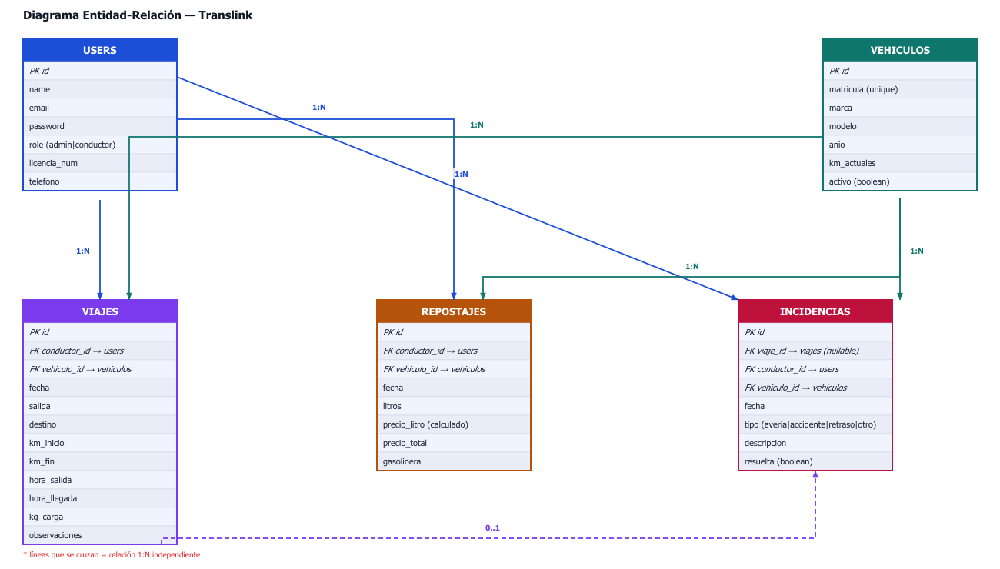

# Translink

Aplicación web de gestión de flotas para pymes del transporte por carretera, desarrollada como Trabajo de Fin de Grado (TFG) del ciclo formativo de Desarrollo de Aplicaciones Web (DAW).

## Descripción

Translink permite a pequeñas y medianas empresas de transporte gestionar su flota de vehículos de forma centralizada. La aplicación cubre el ciclo completo de operaciones: registro de viajes, control de repostajes, seguimiento de incidencias y generación de cartas de porte en PDF.

## Características

- Autenticación y gestión de usuarios (registro, login, perfil)
- Gestión de vehículos (alta, edición, listado)
- Registro y seguimiento de viajes
- Control de repostajes por vehículo
- Gestión de incidencias
- Generación de cartas de porte en PDF
- Interfaz responsive con Tailwind CSS

## Tecnologías

| Capa | Tecnología |
|------|-----------|
| Backend | PHP 8.2 + Laravel 12 |
| Frontend | Blade + Tailwind CSS + Vite |
| Base de datos | MySQL |
| PDF | barryvdh/laravel-dompdf |
| Autenticación | Laravel Breeze |

## Requisitos

- PHP >= 8.2
- Composer
- Node.js y npm
- MySQL
- XAMPP (o servidor web equivalente)

## Instalación

```bash
# 1. Clonar el repositorio
git clone https://github.com/tu-usuario/translink-app.git
cd translink-app

# 2. Instalar dependencias PHP
composer install

# 3. Instalar dependencias JS
npm install

# 4. Configurar entorno
cp .env.example .env
php artisan key:generate

# 5. Configurar base de datos en .env
DB_DATABASE=translink
DB_USERNAME=root
DB_PASSWORD=

# 6. Ejecutar migraciones y seeders
php artisan migrate --seed

# 7. Compilar assets
npm run build

# 8. Iniciar servidor
php artisan serve
```

## Estructura del proyecto

```
translink-app/
├── app/
│   ├── Http/Controllers/   # Controladores (Viaje, Vehículo, Repostaje, Incidencia...)
│   ├── Models/             # Modelos Eloquent
│   └── ...
├── database/
│   ├── migrations/         # Migraciones de base de datos
│   └── seeders/            # Datos de prueba
├── resources/
│   └── views/              # Plantillas Blade
├── routes/
│   └── web.php             # Rutas de la aplicación
└── public/                 # Assets públicos
```

## Diagramas

<p align="center">
  
</p>

## Autor

**Pablo Combarros Recuerda**  
Ciclo Formativo de Grado Superior — Desarrollo de Aplicaciones Web (DAW)

[](https://www.linkedin.com/in/pablo-combarros/)
[](https://github.com/PabloCombarros)
